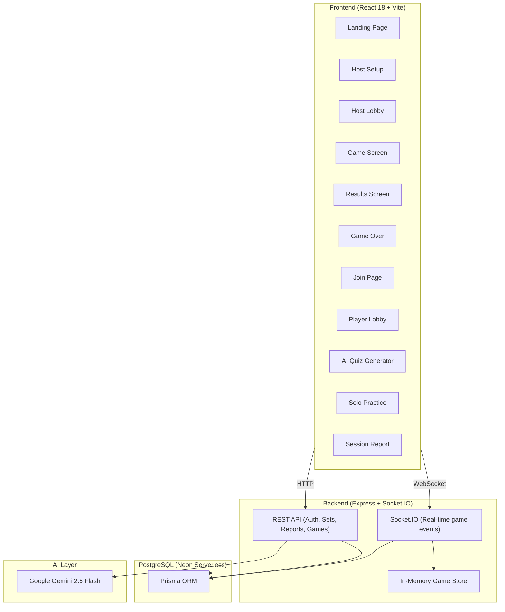
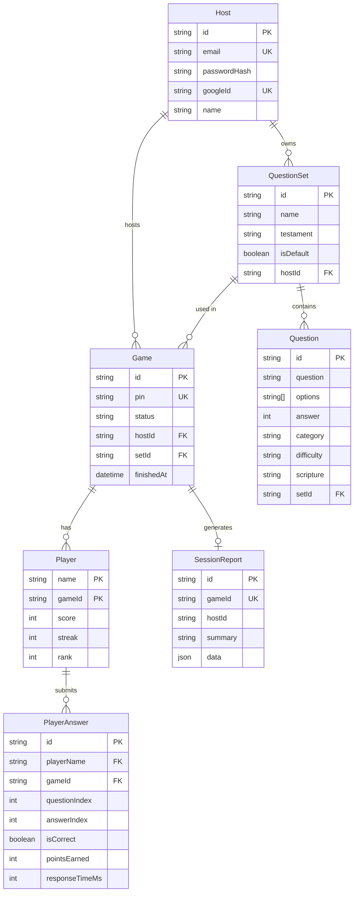

# ⚔️ Bible Banter — Project Analysis

> **Repo**: `shadrack-ss/BitbleBattle` · **Type**: Full-stack real-time multiplayer Bible trivia game (Kahoot-style)

---

## 🏗️ Architecture Overview



---

## 📁 Project Structure

| Path | Purpose | Size |
|------|---------|------|
| [server.js](file:///c:/Desktop/hackthon/server.js) | **Monolithic backend** — Express routes, Socket.IO handlers, AI prompts, game logic | 1,123 lines |
| [questions.js](file:///c:/Desktop/hackthon/questions.js) | Default question bank (24 hardcoded questions) | 221 lines |
| [middleware/auth.js](file:///c:/Desktop/hackthon/middleware/auth.js) | JWT middleware (`requireHost`, `optionalHost`) | 28 lines |
| [prisma/schema.prisma](file:///c:/Desktop/hackthon/prisma/schema.prisma) | Database schema (7 models) | 96 lines |
| [prisma/seed.js](file:///c:/Desktop/hackthon/prisma/seed.js) | Seeds default question set into DB | — |
| [client/src/App.jsx](file:///c:/Desktop/hackthon/client/src/App.jsx) | Main React component — state machine for 15+ screens | 442 lines |
| `client/src/pages/` | 17 page components | ~175 KB total |
| `client/src/components/` | 4 shared components (Confetti, ConfirmModal, ThemePicker, Timer) | — |
| `client/src/utils/` | Sound effects + theme utilities | — |

---

## 🛠️ Tech Stack

| Layer | Technology | Version |
|-------|-----------|---------|
| **Frontend** | React + Vite | 18.2 / 5.0 |
| **Styling** | TailwindCSS | v3.3 |
| **Real-time** | Socket.IO Client | 4.7 |
| **Auth (Google)** | `@react-oauth/google` | 0.13 |
| **QR Codes** | `qrcode.react` | 4.2 |
| **Backend** | Express | 4.18 |
| **Real-time** | Socket.IO Server | 4.7 |
| **Database** | PostgreSQL (Neon) via Prisma | Prisma 5.22 |
| **Auth** | JWT (`jsonwebtoken`) + `bcryptjs` | — |
| **AI** | Google Gemini 2.5 Flash (`@google/generative-ai`) | 0.24 |
| **File Parsing** | `multer` + `mammoth` + `pdf-parse` + `csv-parse` | — |
| **Deployment** | Vercel (frontend) + Render (backend) | — |

---

## 🗄️ Database Schema (7 Models)



---

## 🔌 REST API Endpoints (18 routes)

| Method | Route | Auth | Purpose |
|--------|-------|------|---------|
| `POST` | `/api/auth/register` | — | Host registration |
| `POST` | `/api/auth/login` | — | Host login |
| `POST` | `/api/auth/google` | — | Google OAuth sign-in |
| `GET` | `/api/auth/me` | `requireHost` | Current host profile |
| `GET` | `/api/sets` | `optionalHost` | List question sets |
| `POST` | `/api/sets` | `requireHost` | Create question set |
| `PUT` | `/api/sets/:id` | `requireHost` | Rename set |
| `DELETE` | `/api/sets/:id` | `requireHost` | Delete set |
| `GET` | `/api/sets/:id/questions` | `optionalHost` | List questions in set |
| `POST` | `/api/sets/:id/questions` | `requireHost` | Add question to set |
| `PATCH` | `/api/questions/:id` | `requireHost` | Update question |
| `DELETE` | `/api/questions/:id` | `requireHost` | Delete question |
| `POST` | `/api/parse-questions` | `optionalHost` | Upload & parse file (CSV/DOCX/PDF/TXT) |
| `GET` | `/api/question-template.csv` | — | Download CSV template |
| `POST` | `/api/ai/generate-quiz` | `requireHost` | AI-generate quiz from content |
| `POST` | `/api/ai/regenerate-question` | `requireHost` | Regenerate single question |
| `GET` | `/api/games/:id/report` | `requireHost` | Generate/fetch session report |
| `GET` | `/api/reports` | `requireHost` | List all reports |
| `GET` | `/api/games` | `requireHost` | Game history |
| `GET` | `/api/games/:id` | `requireHost` | Single game detail |
| `GET` | `/api/leaderboard` | — | Global leaderboard (top 10) |
| `GET` | `/api/ping` | — | Keep-alive endpoint |

---

## 🎮 Socket.IO Events (Real-time Engine)

| Event | Direction | Payload |
|-------|-----------|---------|
| `create-game` | Client → Server | `{ testament, setId, hostToken, questionTime, rounds }` |
| `join-game` | Client → Server | `{ pin, name }` |
| `start-game` | Host → Server | — |
| `submit-answer` | Player → Server | `{ answerIndex }` |
| `next-question` | Host → Server | — |
| `continue-game` | Host → Server | — (load next batch) |
| `set-questions` | Host → Server | Custom questions array |
| `rejoin-game` | Player → Server | `{ pin, name }` |
| `rejoin-host` | Host → Server | `{ pin }` |
| `player-joined` | Server → Room | `{ players[], name }` |
| `player-left` | Server → Room | `{ players[] }` |
| `game-started` | Server → Room | — |
| `new-question` | Server → Room | Question data + timer |
| `answer-result` | Server → Player | `{ isCorrect, points, streak, scripture }` |
| `answer-progress` | Server → Room | `{ answered, total, leaderboard }` |
| `question-results` | Server → Room | `{ correctAnswer, scripture, leaderboard }` |
| `game-over` | Server → Room | `{ leaderboard, hasMore, dbGameId }` |
| `round-starting` | Server → Room | `{ round, batchStart, batchEnd }` |
| `host-disconnected` | Server → Room | — |

---

## 🧠 AI Integration (Gemini 2.5 Flash)

Two AI features powered by Google Gemini:

1. **Quiz Generation** — Paste sermon notes / upload PDF/DOCX → AI generates 5-10 multiple-choice questions with configurable audience (Gen Z, Youth, Children, Adults, General Church) and tone (Playful, Conversational, Formal, Energetic, Simple).

2. **Understanding Reports** — After each game, AI analyzes player responses and generates a pastoral summary (what the group understood, struggled with, and follow-up suggestions).

---

## 🎯 Game Scoring Logic

| Mechanism | Detail |
|-----------|--------|
| Base points | Up to 1,000 per question |
| Speed bonus | `MAX_POINTS × (0.5 + 0.5 × timeBonus)` where `timeBonus = max(0, 1 - elapsed/limit)` |
| Streak multiplier | 3+ consecutive correct → **1.2×** bonus |
| Question timer | Default 20s (configurable 5-120s) |
| Rounds per batch | Default 10 (configurable 1-50) |
| Auto-advance | Results shown for 7s, then auto-advance to next question |

---

## ✅ Strengths

| Area | Detail |
|------|--------|
| **Feature-rich** | AI quiz gen, file upload parsing, understanding reports, solo practice, themes, global leaderboard — impressive for a hackathon |
| **Reconnection handling** | 20-second grace period for both host and player disconnects with proper socket remapping |
| **Persistence** | Full game history persisted to Neon PostgreSQL — answers, response times, scores, reports |
| **Auth flexibility** | Both email/password and Google OAuth sign-in |
| **File format support** | CSV, DOCX, PDF, and TXT upload with intelligent parsing |
| **Keep-alive** | Self-ping every 5 min to prevent Render/Neon from sleeping |
| **Pagination** | Supports batched rounds for large question sets with "continue game" flow |

---

## ⚠️ Areas for Improvement

### Architecture
| Issue | Severity | Detail |
|-------|----------|--------|
| **Monolithic server.js** | 🟡 Medium | 1,123 lines in a single file — game logic, REST routes, Socket.IO handlers, AI prompts, and file parsing all mixed together. Should be split into modules. |
| **No router separation** | 🟡 Medium | All Express routes defined directly on `app` — no `express.Router()` usage |
| **In-memory game store** | 🟠 High | `const games = {}` means all active games are lost on server restart. Fine for hackathon, risky for production. |
| **No frontend routing** | 🟡 Medium | Uses a manual `screen` state machine in App.jsx (15+ screens via useState) instead of a proper router like React Router |

### Security
| Issue | Severity | Detail |
|-------|----------|--------|
| **CORS wildcard** | 🔴 High | `cors: { origin: '*' }` on both Express and Socket.IO — should be restricted in production |
| **`.env` committed** | 🔴 High | The `.env` file with real credentials (296 bytes) is in the repo. Should be `.gitignore`d |
| **`.env.example` mismatch** | 🟡 Medium | `.env.example` references MongoDB, but the app uses PostgreSQL — confusing for new contributors |
| **JWT in localStorage** | 🟡 Medium | Vulnerable to XSS. HttpOnly cookies would be more secure |
| **No rate limiting** | 🟡 Medium | AI endpoints and auth endpoints have no rate limiting |
| **No input sanitization** | 🟡 Medium | Player names, question text, etc. are not sanitized against XSS |

### Code Quality
| Issue | Severity | Detail |
|-------|----------|--------|
| **No TypeScript** | 🟢 Low | Pure JS throughout — TypeScript would add safety for a codebase this size |
| **No tests** | 🟡 Medium | No test files found anywhere in the project |
| **Global leaderboard bug** | 🟡 Medium | `groupBy` uses `_count: { id: true }` but `Player` has a composite PK `[name, gameId]` — `id` doesn't exist on Player model. This endpoint likely throws. |
| **Inconsistent error handling** | 🟢 Low | Mix of callback-based and try/catch; some errors silently swallowed with `.catch(() => {})` |
| **No loading states** | 🟡 Medium | Many async operations (AI generation, file uploads) lack explicit loading feedback in the UI |

### DevOps
| Issue | Severity | Detail |
|-------|----------|--------|
| **No CI/CD config** | 🟢 Low | No GitHub Actions, no lint/test/build pipeline |
| **No Docker** | 🟢 Low | No containerization for local development consistency |
| **`fetch` used in Node** | 🟢 Low | Keep-alive uses global `fetch` — requires Node 18+ (already specified, but no engine check in package.json) |

---

## 📊 Codebase Metrics

| Metric | Value |
|--------|-------|
| **Total backend JS** | ~1,350 lines |
| **Total frontend JSX** | ~3,700 lines (17 pages + 4 components + App.jsx) |
| **Backend dependencies** | 12 production + 1 dev |
| **Frontend dependencies** | 5 production + 6 dev |
| **Database models** | 7 |
| **REST endpoints** | 18+ |
| **Socket events** | 18 |
| **Default questions** | 24 |
| **AI features** | 2 (quiz generation + understanding reports) |
| **Screens/views** | 17 |

---

## 🚀 Quick Start

```bash
# Backend
npm install
npx prisma db push        # create tables
node prisma/seed.js        # seed default questions
node server.js             # starts on :3001

# Frontend (separate terminal)
cd client
npm install
npm run dev                # starts on :5173
```

**Required env vars**: `DATABASE_URL`, `JWT_SECRET`, `GEMINI_API_KEY` (optional for AI), `GOOGLE_CLIENT_ID` (optional for Google sign-in)
